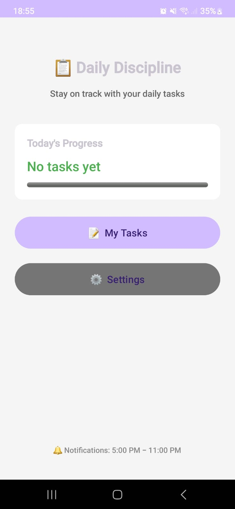
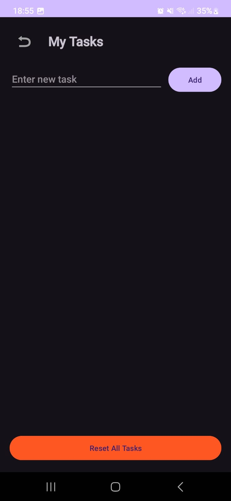
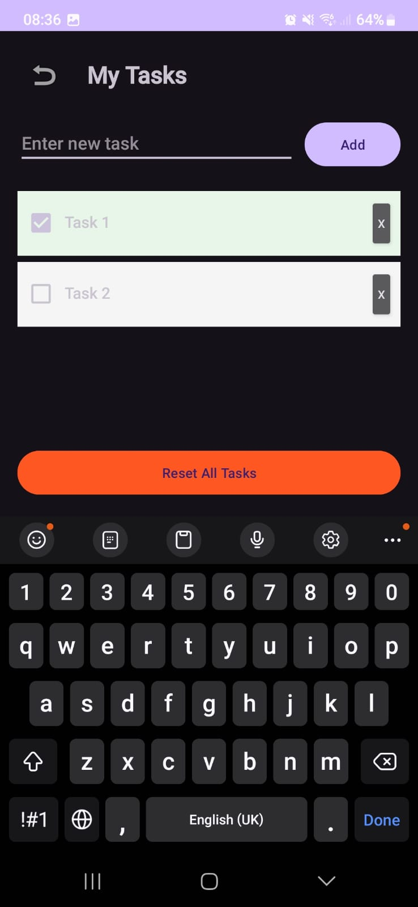
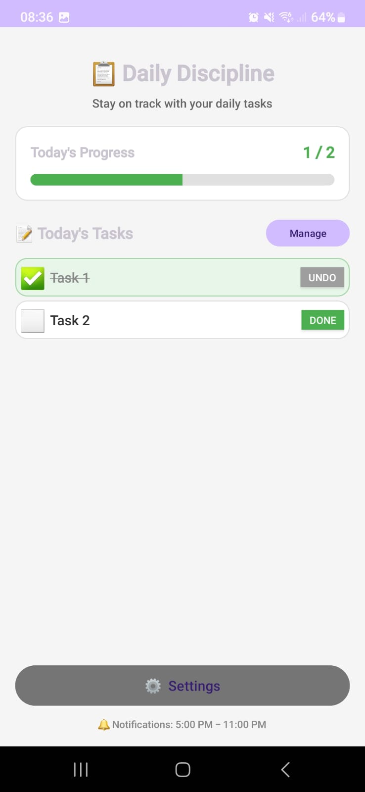
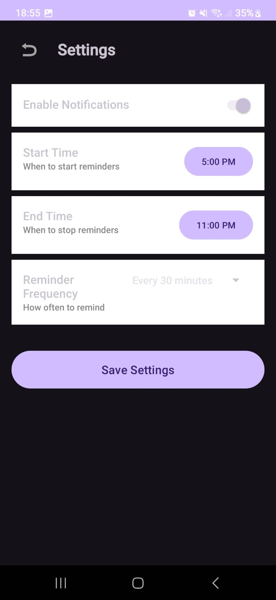

# Daily Discipline Task Manager 📋✅

Android Kotlin app: **Add daily tasks → Check completion → Get customizable reminder notifications**.

## 🎯 Screenshots

  
  
  
  
  

## ✨ Features

### 🏠 Home Screen
- 📊 Daily progress overview with progress bar
- 📋 View all tasks directly on home screen
- ✅ Visual completion status (green + checkmark)
- ⬜ Pending tasks indicator (white + empty box)
- 💬 Confirmation dialog before marking complete
- 🎉 Celebration message when all tasks done
- 🔘 Quick access to Task Management and Settings

### 📝 Task Management
- ➕ **Add/Remove Tasks**: Simple task management
- ☑️ **Checkbox Completion**: Visual feedback (green highlight)
- ↩️ **Undo Completion**: Easily revert completed tasks
- 🔄 **Reset All**: Uncheck all tasks with one tap
- 🔄 **Daily Auto-Reset**: Tasks reset automatically each new day

### ⚙️ Customizable Settings
- 🕐 **Start Time**: Set when reminders begin
- 🕐 **End Time**: Set when reminders stop
- ⏱️ **Frequency**: Choose reminder interval (15min / 30min / 45min / 1hr / 2hr)
- 🔔 **Toggle**: Enable/disable notifications

### 🔔 Smart Notifications
- Only triggers if tasks are incomplete
- Respects your custom schedule
- Auto-resets tasks daily

## 🛠️ Tech Stack
- Kotlin 1.9+
- Android SDK 34 / Min 26
- AlarmManager + NotificationManager
- SharedPreferences
- Multi-Activity Architecture

## 🚀 Quick Setup
1. Clone: git clone https://github.com/RJSLabbert/Daily_Discipline_Tracker.git
2. Open in Android Studio
3. Build & Run on device/emulator
4. Grant notification permission when prompted

## 📁 Project Structure

**Java Files** (`app/src/main/java/com/example/dailydiscipline/`)
- `MainActivity.kt` - Home screen with task display
- `TasksActivity.kt` - Task management
- `SettingsActivity.kt` - Notification settings
- `NotificationReceiver.kt` - Handles notifications
- `BootReceiver.kt` - Boot handling

**Layout Files** (`app/src/main/res/layout/`)
- `activity_main.xml` - Home layout with task list
- `activity_tasks.xml` - Tasks management layout
- `activity_settings.xml` - Settings layout

**Drawable Files** (`app/src/main/res/drawable/`)
- `card_background.xml` - Card styling
- `task_completed_background.xml` - Completed task styling
- `progress_bar_style.xml` - Progress bar styling

## 🔧 Troubleshooting

Click to Expand

### 1. No Notifications Appearing
**Issue**: App runs but no notifications at scheduled times.

**Fix**:
- Settings > Apps > Daily Discipline > Permissions > Enable Notifications
- Android 12+: Enable Alarms & Reminders permission
- Disable battery optimization for app

### 2. Tasks Not Saving
**Issue**: Tasks disappear after closing app.

**Fix**:
- Clear app data: Settings > Apps > Daily Discipline > Storage > Clear Data
- Reinstall app

### 3. Settings Not Applying
**Issue**: Notification times not changing.

**Fix**:
- Make sure to tap "Save Settings" button
- Check that End Time is after Start Time

### 4. Permission Denied on Android 13+
**Issue**: Notification permission error.

**Fix**:
- Manually enable notifications in device settings

### 5. Tasks Not Resetting Daily
**Issue**: Tasks don't auto-reset at midnight.

**Fix**:
- Open the app once each day to trigger reset
- Reset happens when app opens, not at exact midnight
- Clear app data and reopen: Settings > Apps > Daily Discipline > Storage > Clear Data

**How It Works**:
- App stores last reset date
- On every app open, compares today vs last reset
- If different day, all tasks marked incomplete

### 6. Confirmation Dialog Not Showing
**Issue**: Tasks complete without asking.

**Fix**:
- Update to v2.0.2 or later
- Confirmation only shows for "Done" button, not "Undo"

## 📋 Version History

| Version | Date | Changes |
|---------|------|---------|
| v2.0.2 | 2024 | Home screen tasks, confirmation dialog, celebration message |
| v2.0.1 | 2024 | Daily auto-reset fix |
| v2.0.0 | 2024 | Home screen, Settings, Custom notifications |
| v1.0.0 | 2024 | Initial release, Basic task management |

## 🆕 Latest Changes (v2.0.2)

- 📋 Tasks now display on home screen
- ✅ Green background + checkmark for completed tasks
- ⬜ White background + empty box for incomplete tasks
- ~~Strikethrough~~ text for completed task names
- 💬 Confirmation dialog: "Are you sure?" before marking done
- 🎉 Celebration popup when all tasks completed
- ↩️ Undo button to revert completed tasks

## 👤 Author
**RJS Labbert**
- GitHub: [@RJSLabbert](https://github.com/RJSLabbert)

---
